# About Minwook Je

# `Minwook Je`
### 제 민 욱

---

## Experience
1. `Bear robotics` / 풀스택 개발자
    - 자율주행 서빙 로봇, 자율주행 방역 로봇
2. `카카오 블록체인` / 서버 개발자
    - 카카오콘, 카카오 팬템, 카카오 국가기술자격증, 디지털 카드, Krust
3. `SEMES`  / 임베디드 소프트웨어 개발
    - 반도체 에치 공정 로봇 SW

## Extra Curricular
4. `NEXTERS` 운영진 / 19기 CTO, 18- 21기 개발자 
5. `멋쟁이사자처럼` 운영진 

---

# 1. Kakao Con (카카오콘)
> 카카오를 쓰는 만큼 돌려받을 수 있는 `암호화폐` 리워드

--- 
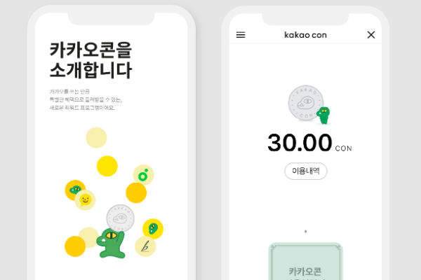

카카오 내부에서 동작하는 **프라이빗 블록체인**에서, 사용자들이 `카카오콘`이라는 암호화폐를 얻을 수 있도록 하는 **화폐 시스템**

- 발행 조건 예시
    1. 신규 사용자 / 생일
    2. 멜론 음악 사용자
    3. 카카오 계정 통합 등

---

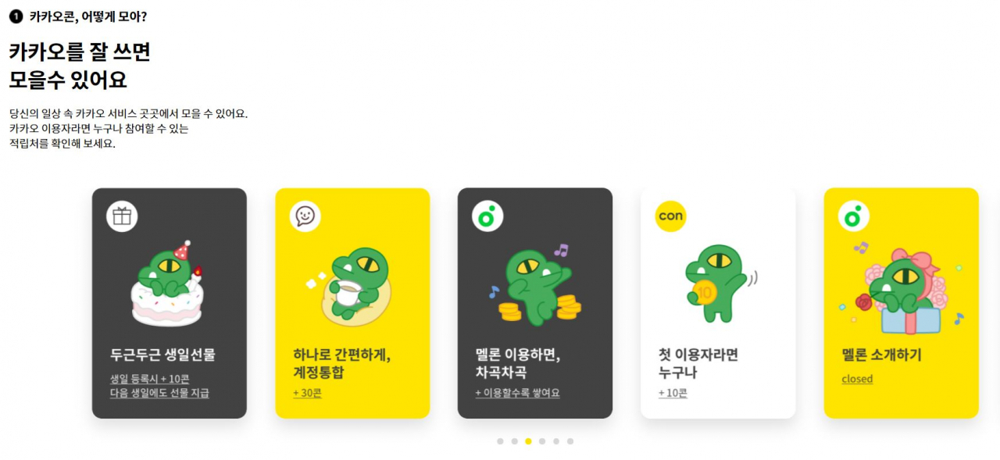
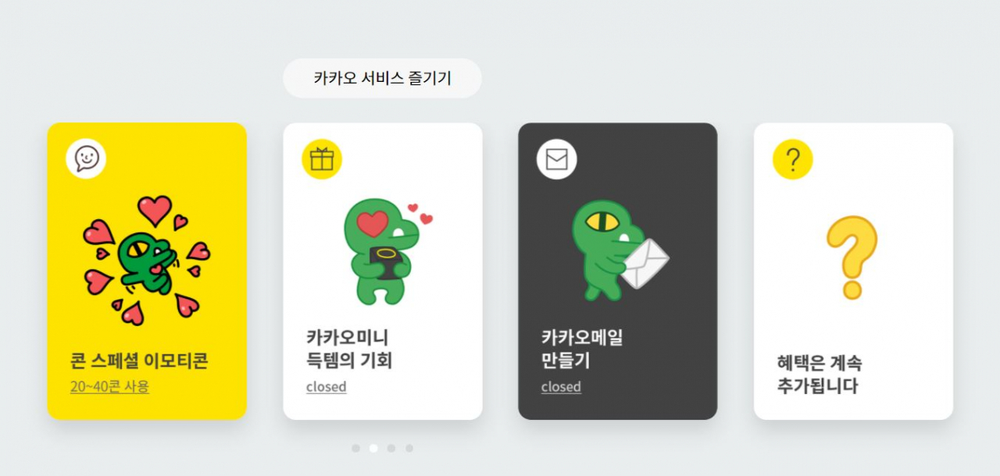

---

# 2. Kakao Fantem (응원보드 / 팬템)
> 자신이 좋아하는 아티스트를 응원할 수 있는 **팬 아이템** NFT

--- 
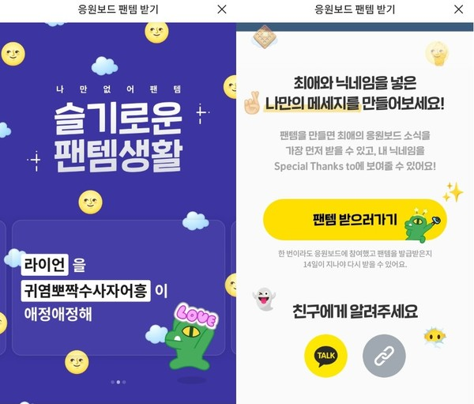

자신이 응원하고 싶은 `아티스트`와 그 아티스트를 좋아하는 `팬의이름` 그리고 메시지를 넣어, **NFT로 발행**합니다.

NFT가 발행된 팬은 `아티스트 응원보드`에 자신의 `닉네임을 노출` 시킬 수 있으며, **가장 먼저 아티스트의 소식을 톡으로 접할 수 있습니다**.

---

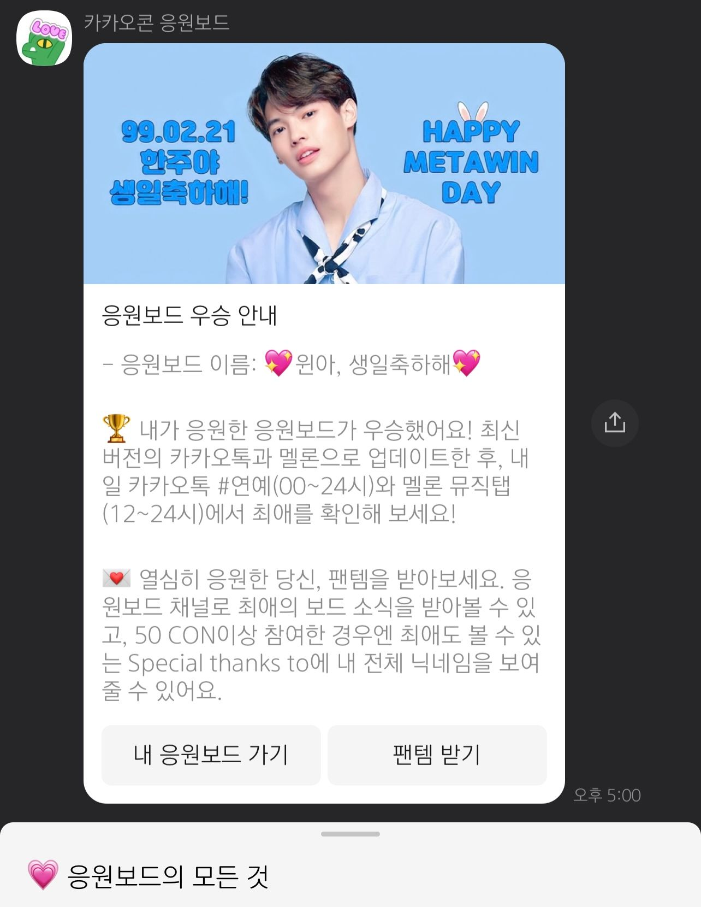
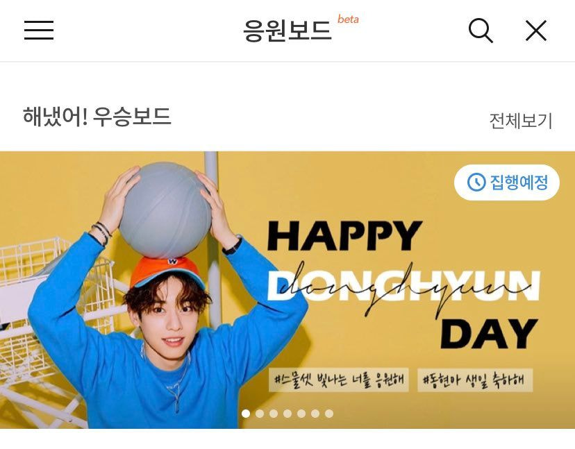

---

# 3. 국가기술 자격증
> 한국산업인력공단의 국가자격 전자증명 서비스 NFT

---

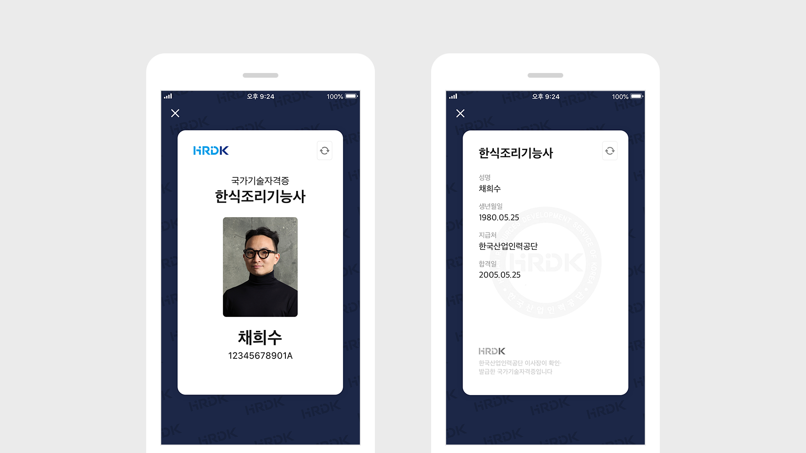

- 한국 산업인력공단에서 제공하는 자격증을 NFT화
- 정보처리기사·한식조리기능사 등 495종의 국가기술자격증을 NFT로 구현

---

# 4. 카카오 디지털카드
> 시중 플라스틱 카드 및 종이티켓 디지털 카드로 대체하는 ESG 서비스

---

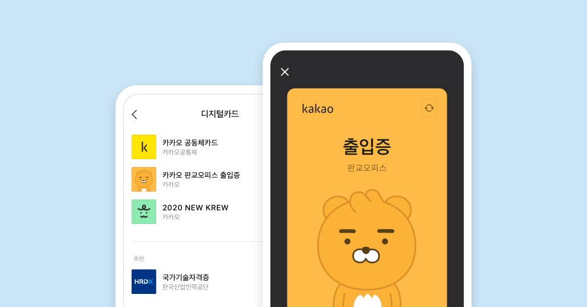

- `신분증`, `자격증`, `멤버십`, `입장권`, `보증서` 등 아우르는 디지털카드와 발급 시스템 개발

- 출입키 전문업체 모카 시스템과 기술제휴로 `디지털 사원증 서비스`

---

# 5. 카카오 Krust

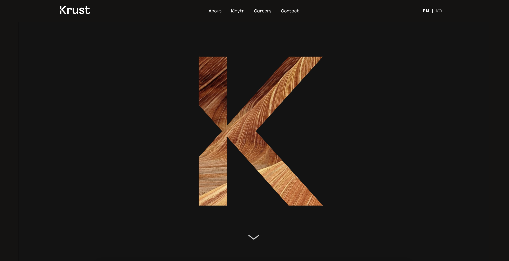

카카오 CTO 함께, 카카오에서 블록체인을 이끌었던 모든 개발자 `Krust`회사 창업

이로 인해 카카오에 남아있는 암호화폐 서비스, 디지털 카드, 국가 자격증 서비스 등 모두 전임 운영

---

# 5-1. 클레이튼 노드 운영

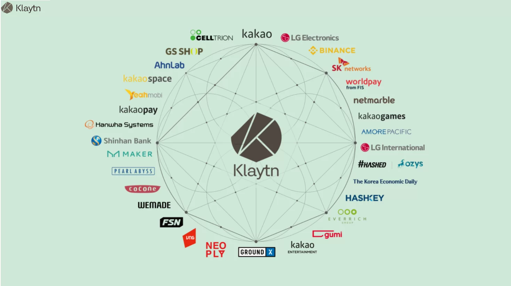

대표적으로 카카오, 카카오 엔터프라이즈, 카카오 VX의 `클레이튼 노드` 서버를 전부 관리

---

# 6. 카카오 지갑

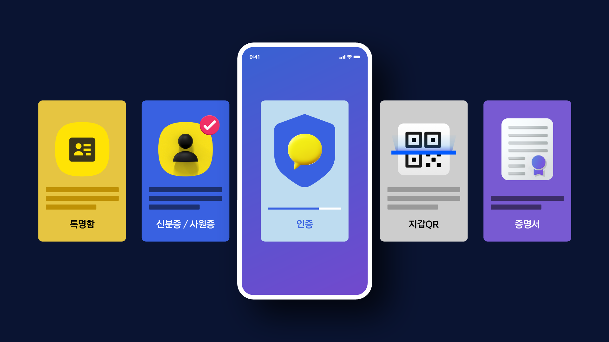

블록체인 팀 분사이후, 카카오 지갑으로 부서 이동하여 디지털 카드 플랫폼 개발 / 운영 후 이직

